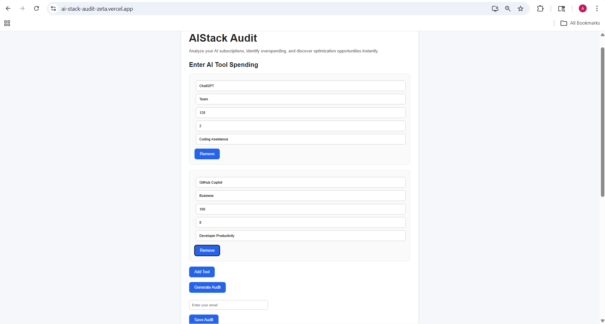
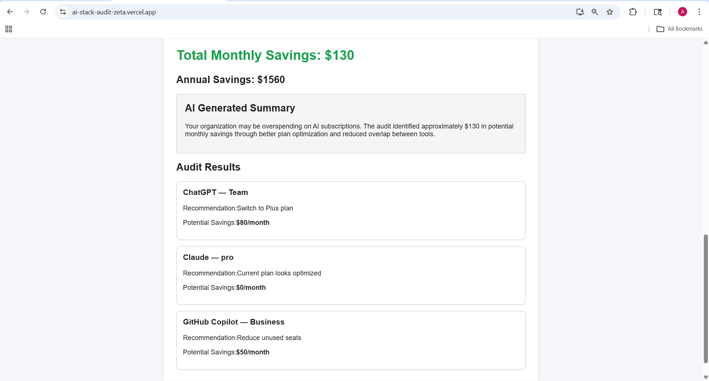
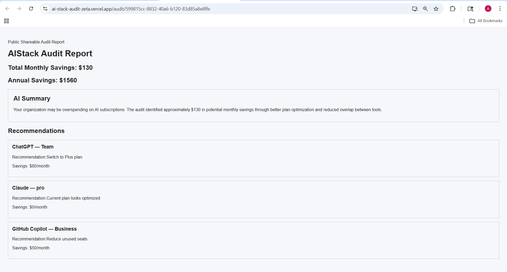

# AIStack Audit

AIStack Audit is a SaaS-style web application that helps users analyze AI subscription spending, identify overspending, and discover optimization opportunities.

The platform acts as an AI cost optimization tool where users can:
- Enter AI tools and subscription details
- Analyze monthly and yearly spending
- Receive optimization recommendations
- Generate AI-powered audit summaries
- Save and share public audit reports

---

# Live Demo

Frontend:
https://ai-stack-audit-zeta.vercel.app/

Backend:
https://aistack-audit-backend.onrender.com

---

# Features

- Dynamic AI spend input form
- Multiple AI tool support
- Rule-based audit engine
- Monthly & yearly savings calculations
- AI-generated audit summaries
- Email capture workflow
- Shareable public audit URLs
- Dynamic public audit pages
- SEO optimization
- SaaS-style UI design

---

# Screenshots

## Landing Page

---

## Audit Results

---

## Public Audit Report

---

# Tech Stack

## Frontend
- React
- JavaScript
- CSS
- React Router

## Backend
- Node.js
- Express.js

## Deployment
- Vercel
- Render

---

# Shareable Reports

Every saved audit generates a unique public URL.

Example:
https://ai-stack-audit-zeta.vercel.app/audit/:id

---

# Architecture Overview

User → React Frontend → Express Backend → Audit Engine → Storage Layer

The architecture was intentionally designed to:
- support fast MVP iteration
- separate frontend and backend responsibilities
- allow future database scalability
- support public SaaS workflows

Detailed architecture documentation is available in:
- ARCHITECTURE.md

---

# User Research

The project includes user interview research documenting:
- AI subscription behavior
- Overlapping SaaS usage
- Optimization pain points
- AI spending habits

Research documentation:
- USER_INTERVIEWS.md

---

# SEO Optimization

The application includes:
- Meta descriptions
- Open Graph tags
- SEO-focused titles
- Shareable public audit URLs

---

# Future Improvements

Potential future improvements include:
- Firebase/Supabase integration
- Real LLM-generated summaries
- Transactional email delivery
- Team dashboards
- PDF export support
- Stripe billing integration

---

# Deployment Notes

- Frontend deployed using Vercel
- Backend deployed using Render
- Render free tier may take a few seconds to wake after inactivity

---

# Author

Apurv Ranjane

